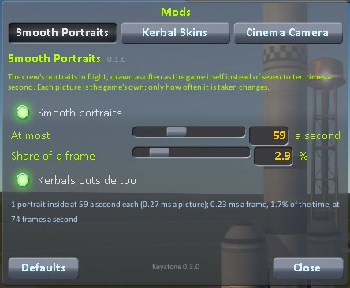

# Smooth Portraits

The crew's portraits at the bottom right of the flight screen, drawn as often as the game itself.

The game lets each portrait's camera take a picture only seven to ten times a second, however fast the
game runs, which is why the faces jerk. This mod has the pictures taken as often as the screen is redrawn,
up to a limit you set. Nothing about a picture is changed: each is taken by the game's own code with the
same camera at the same size.

For Kerbal Space Program 1.12.x. Needs [Keystone](https://github.com/IshiakiZ/ksp-keystone), which comes in the download.

## Install

Copy the `Keystone` and `SmoothPortraits` folders from the download's `GameData` into your KSP `GameData`.
It is on as installed.

## Settings

In the Keystone window (the keystone button on the game's toolbar, or Option-K on a Mac, Alt-K elsewhere).
Drag a slider, or type a number into the box beside it.

| Setting | Installed as | |
| --- | --- | --- |
| Smooth portraits | on | off: the game draws the portraits itself again |
| At most | 60 a second | the most pictures each portrait gets in a second |
| Share of a frame | 3 % | the most of each frame's time the portraits may take |
| Kerbals outside too | on | off leaves the portraits of kerbals outside the ship to the game |

## Good to know

* **What it costs:** about 0.2 ms a frame for one portrait at 60 pictures a second (1.5% at 80 frames a
  second), and never more than the share you set: where that does not pay for every portrait in every
  frame, the portraits take turns.

## Where it works

| System | |
| --- | --- |
| Mac | Made and tried here. |
| Windows | Tried on Windows 11 (KSP 1.12.5): one portrait at 60 pictures a second, 0.13 ms a frame, by the mod's own report on its page. |
| Linux | **Never run.** It is plain C# with no shader or library of its own. |

More: [how it works](https://github.com/IshiakiZ/ksp-smooth-portraits/wiki/How-it-works),
[what it costs, as measured](https://github.com/IshiakiZ/ksp-smooth-portraits/wiki/What-it-costs),
[limits](https://github.com/IshiakiZ/ksp-smooth-portraits/wiki/Limits),
[building it yourself](https://github.com/IshiakiZ/ksp-smooth-portraits/wiki/Building).

## Licence

[MIT](LICENSE).
